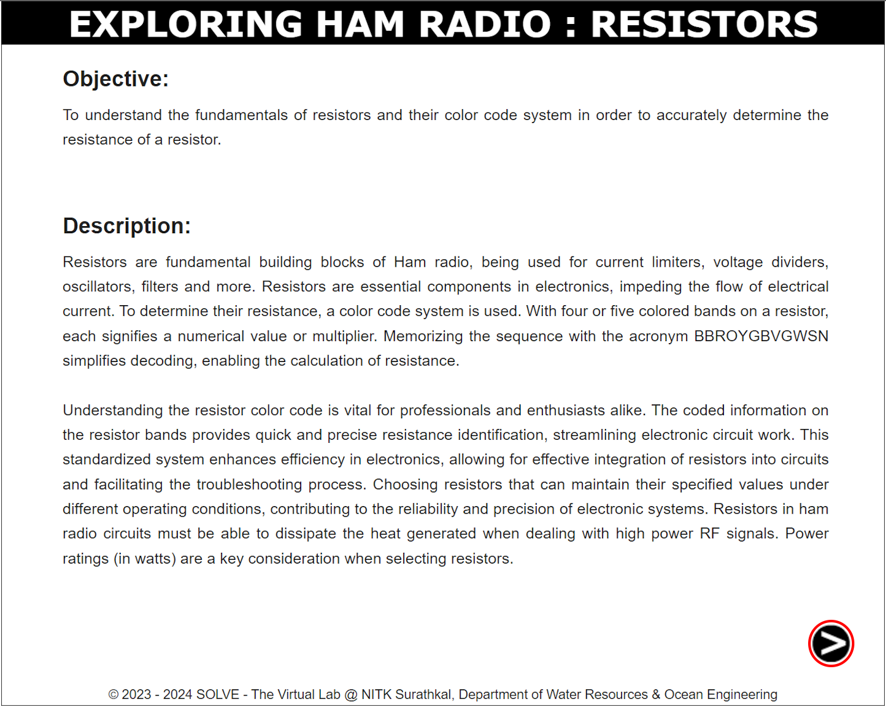
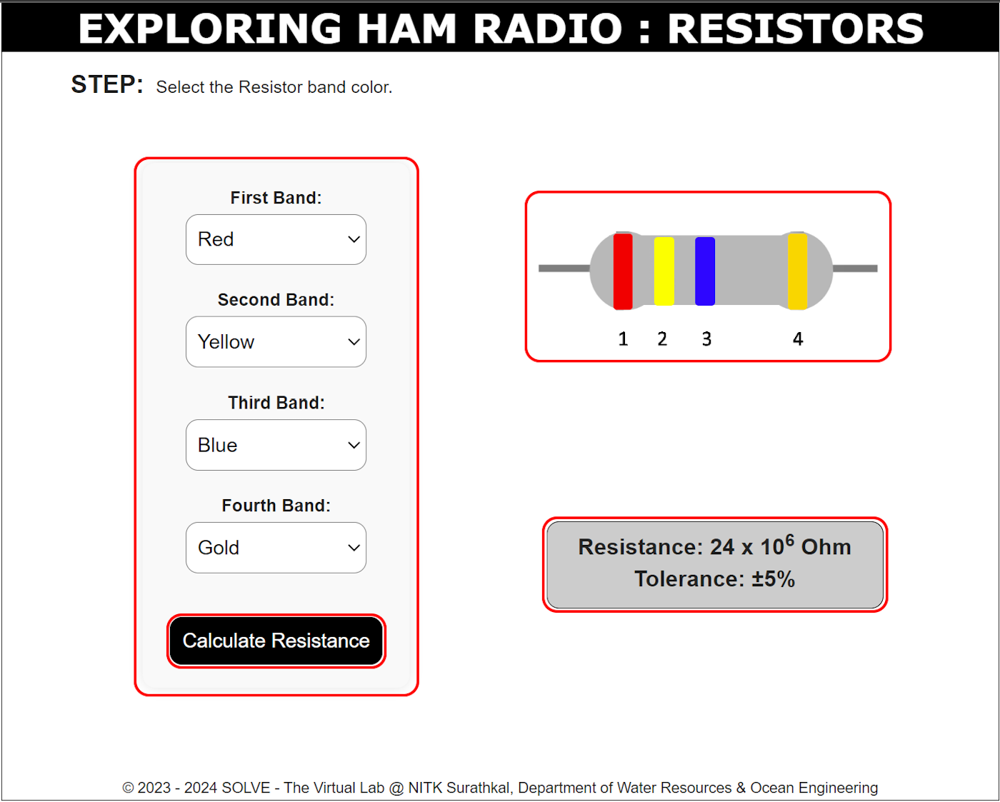

### These procedure steps will be followed on the simulator  

1. Open the simulation of Resistors and go through the Objective and Description, then click the 'NEXT' button in the bottom right corner.

2. Choose the colors of the resistor bands from the first to the fourth band to display them on the resistor. Click the 'Calculate Resistance' button to find the resistance value. You can repeat this process by changing the colors and clicking the button again to see the new resistance value.

